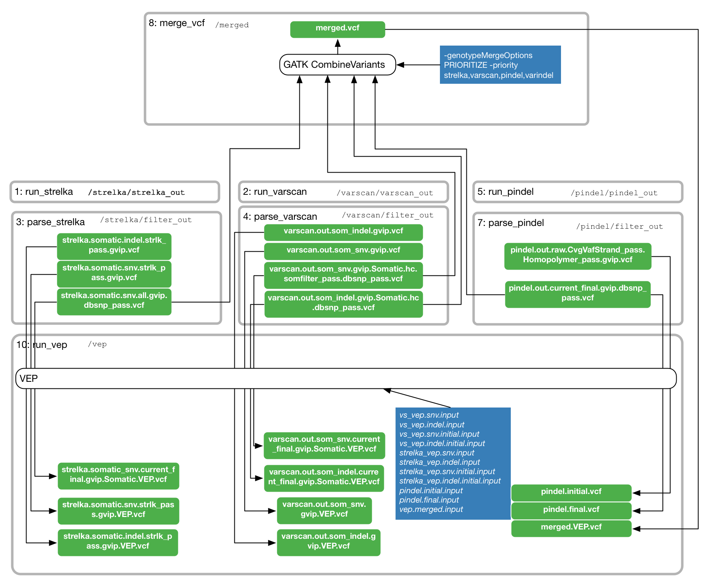
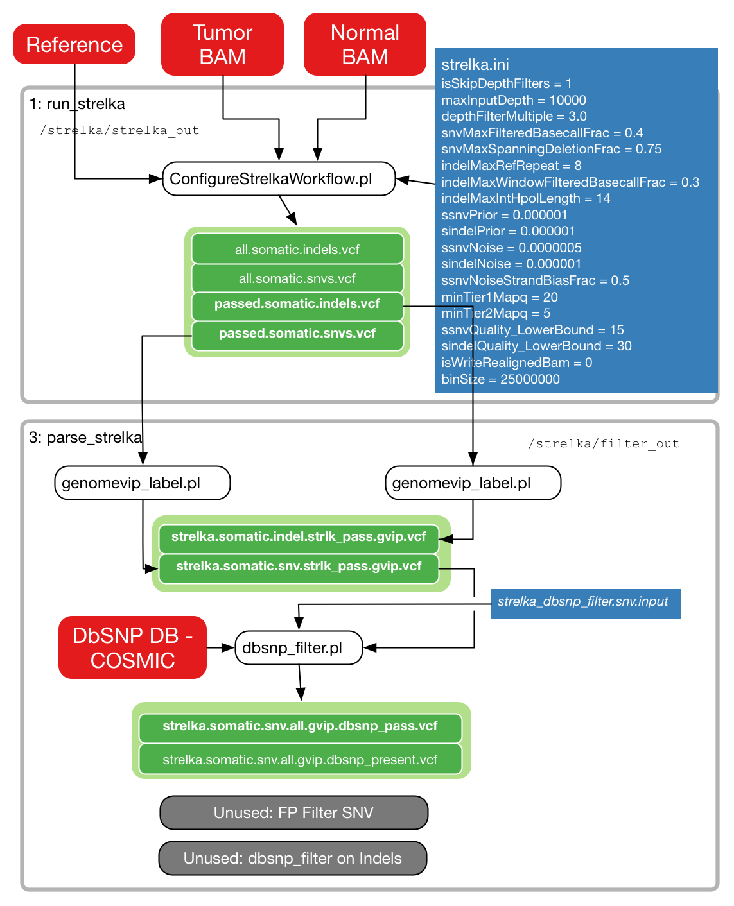
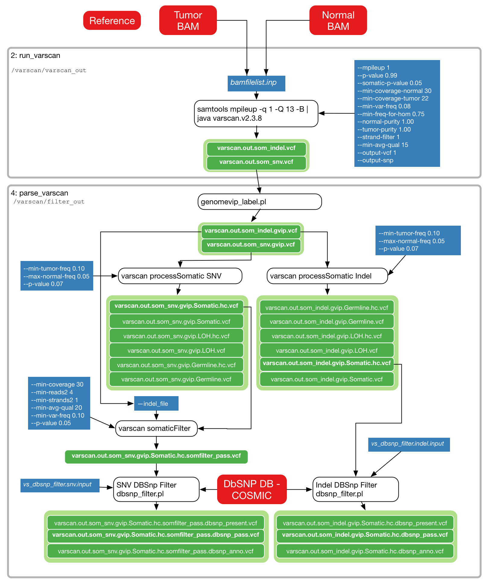

**This branch is deprecated.**  See [TinDaisy-Core](https://github.com/ding-lab/TinDaisy-Core) for more recent work.

# somaticwrapper
Detect somatic variants from tumor and normal exome data

SomaticWrapper pipeline is a fully automated and modular software package
designed for detection of somatic variants from tumor and normal exome data. 
It was developed from GenomeVIP. Multiple standard
variant callings are included in the pipeline such as varscan, strelka and
pindel. 

## Installation

See [SomaticWrapper.CPTAC3.b1](https://github.com/ding-lab/SomaticWrapper.CPTAC3.b1) for details
about installation and usage of SomaticWrapper

## Implementation

## Branches

Docker branch is designed to maintain compatibility with MGI/DC2 workflows in SomaticWrapper.Workflow

## Authors

* Song Cao
* Matthew Wyczalkowski
