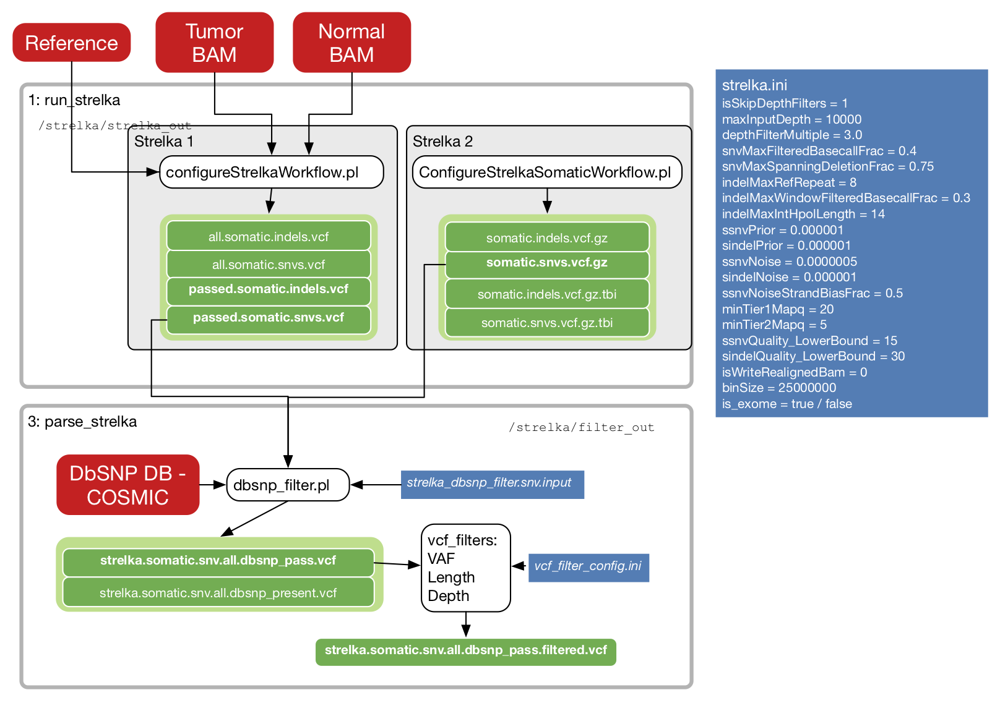
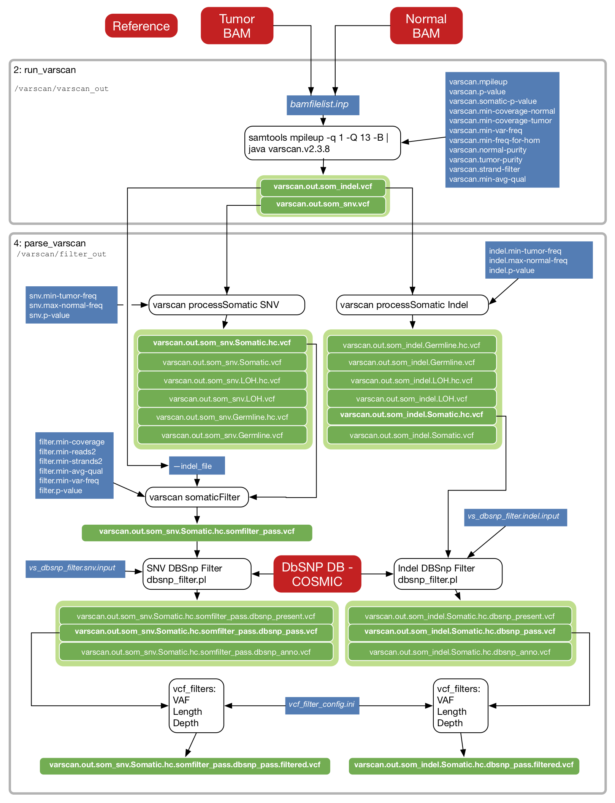
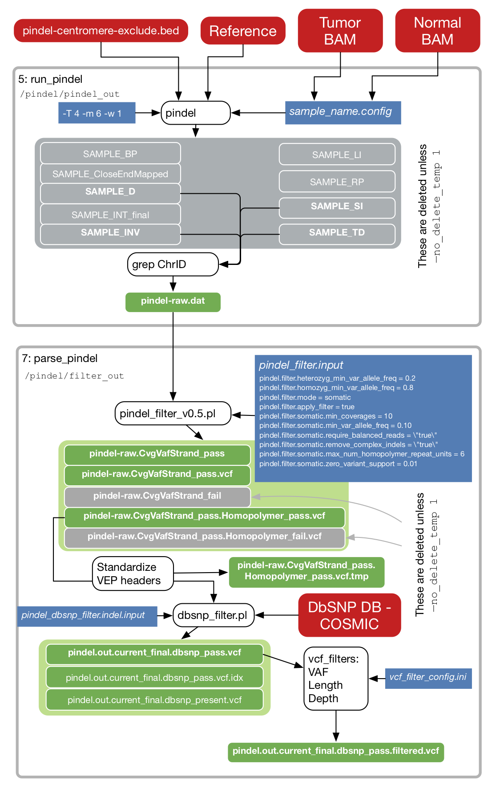
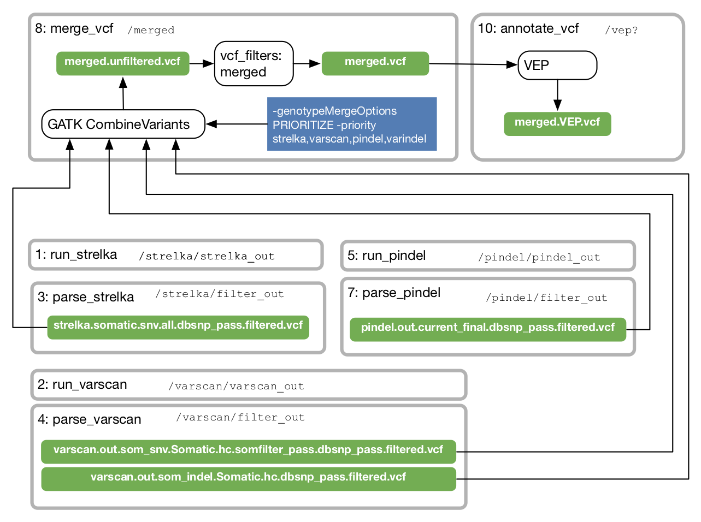

**This branch is deprecated.**  See [TinDaisy-Core](https://github.com/ding-lab/TinDaisy-Core) for more recent work.

# somaticwrapper
Detect somatic variants from tumor and normal exome data

SomaticWrapper pipeline is a fully automated and modular software package
designed for detection of somatic variants from tumor and normal exome data. 
It was developed from GenomeVIP. Incorprates varscan, strelka, and pindel for variant calling.

## Installation

See [SomaticWrapper.CPTAC3.b1](https://github.com/ding-lab/SomaticWrapper.CPTAC3.b1) for details
about installation and usage of SomaticWrapper

## Implementation

### Strelka

### Varscan

### Pindel

### Merging

## CWL branch

The primary branch used for this work is CWL branch.

`cwl` branch makes changes to make SomaticWrapper operate in CWL environment. Specific changes:
  * all arguments are passed on command line, rather than configuraiton file
  * Output directory is passed as an argument explicitly, so that directry structure is not
    dependent on run name
  * inputs and outputs are more explicitly defined
  * All steps need to have input data passed as an argument
    * in cases where a tool writes its output to the same directory as input data (`pindel_filter` and `varscan` do this)
      in order to control where output goes, we create a link to the input data in the output directory
  * One of the steps in `parse_pindel`, the `grep ChrID` step, was moved to `pindel_run`
  * All references of `genomevip_label` were removed, simplifying internal data file structure

### `run_vep`

The script `run_vep` has been replaced by a more CWL-friendly version, `annotate_vep`.  The latter
takes one VCF file as input and writes an annotated VCF (or VEP) file. As such, this "step" may be used
to process any number of files by placing it in their workflow

VEP Cache GZ file may be obtained [here](ftp://ftp.ensembl.org/pub/current_variation/VEP/) (e.g., [homo_sapiens_vep_93_GRCh38.tar.gz](ftp://ftp.ensembl.org/pub/current_variation/VEP/homo_sapiens_vep_93_GRCh38.tar.gz) )

## Authors

* Song Cao
* Matthew Wyczalkowski
